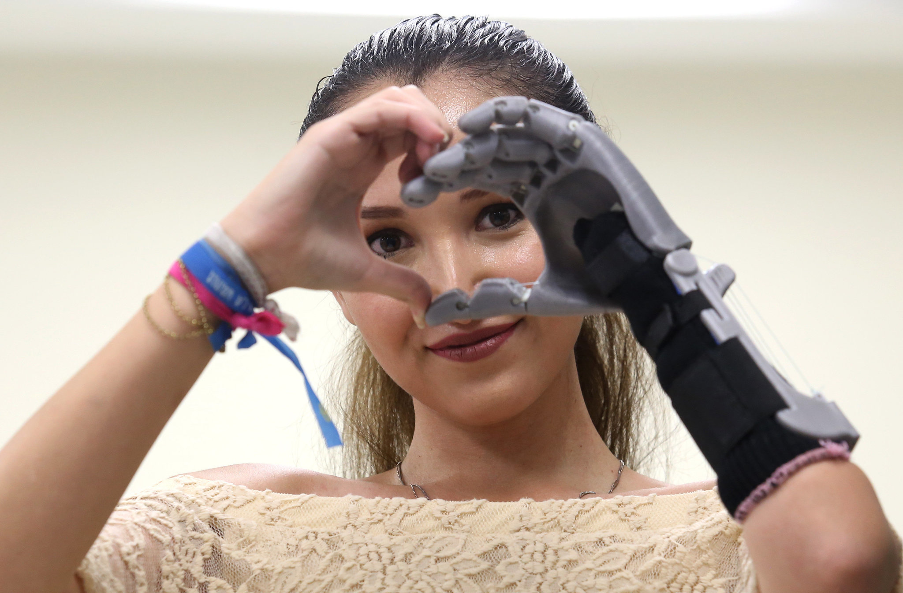
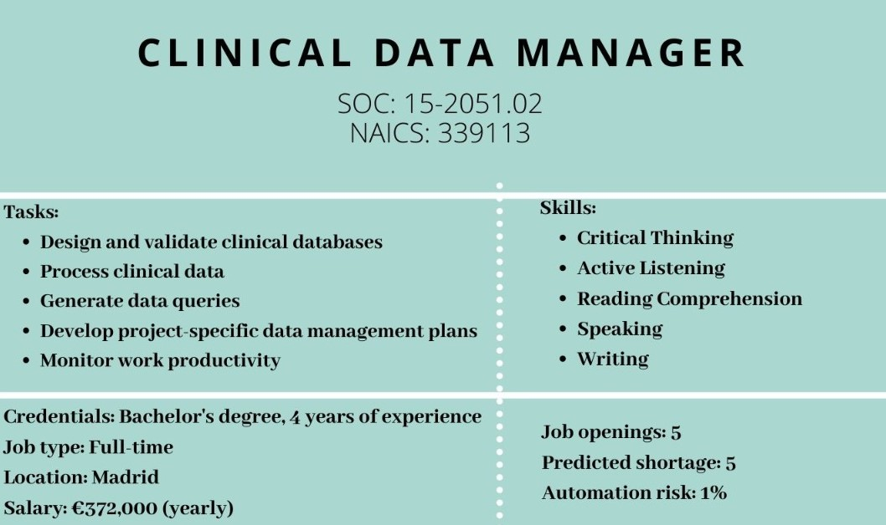

#                                                                               AVARMED


We are a company from Pamplona, Navarre. We are specialized in external prosthetics. We work with the latest technology in 3D printing, with innovative and personal designs for every patients' needs.
 
 We are commited with social responsibility and equity, working as volunteers helping least developed countries with our prosthetics. 




You can use the [editor on GitHub](https://github.com/Ainhoa-Urtasun-UPNA/hohr-project-group-assignment-avarmed/edit/gh-pages/index.md) to maintain and preview the content for your website in Markdown files.

Whenever you commit to this repository, GitHub Pages will run [Jekyll](https://jekyllrb.com/) to rebuild the pages in your site, from the content in your Markdown files.

# History
We started blablabla.
Due to the pandemic, blablabla

# News
We have received a fund from the EU: ECO funds. An we ar super japi

### Markdown

Markdown is a lightweight and easy-to-use syntax for styling your writing. It includes conventions for

```markdown
Syntax highlighted code block

# Header 1
## Header 2
### Header 3

- Bulleted
- List

1. Numbered
2. List

**Bold** and _Italic_ and `Code` text

[Link](url) and 
```

For more details see [GitHub Flavored Markdown](https://guides.github.com/features/mastering-markdown/).

### Recruitment Process:

1) **Job posting**

2) **Sorting and screening out job candidates happens**

3) **Hiring process:**

   -Resume and credentials

   -Psychotechnical exam 

   -Interview

   -Practical part

4) **Onboarding**

### Job Posting 


### Support or Contact

Having trouble with Pages? Check out our [documentation](https://docs.github.com/categories/github-pages-basics/) or [contact support](https://support.github.com/contact) and we’ll help you sort it out.

# Our team


# Job offers
We are looking forward to working with you!


