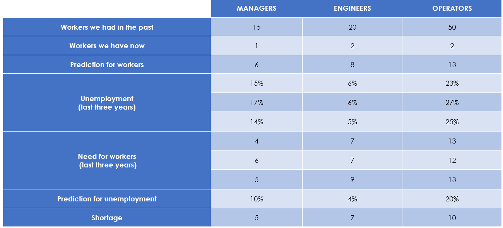
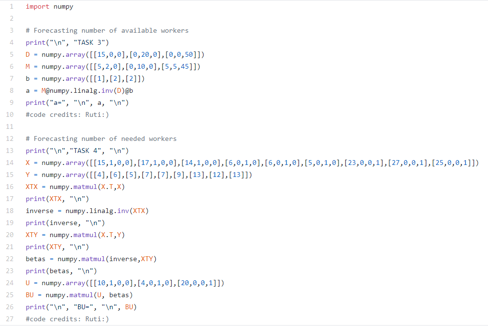

#                                                                               AVARMED

If the images do not work, please visit: https://docs.google.com/presentation/d/1tQ6YnvLIhR6890R4hFa8KOZzscMGlRhlKx-XU9JUlDY/edit?usp=sharing

## About us:

### Recruitment Process:

1) **Job posting**

2) **Sorting and screening out job candidates happens**

3) **Hiring process:**

   -Resume and credentials

   -Psychotechnical exam 

   -Interview

   -Practical part

4) **Onboarding**

### Our team and our future

### Work with us!:  

