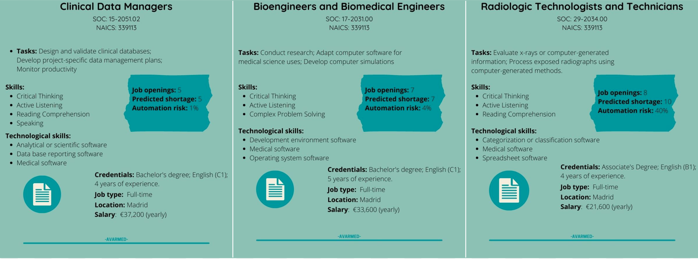

#                                                                               AVARMED


## About us:


### Recruitment Process:

1) **Job posting**

2) **Sorting and screening out job candidates happens**

3) **Hiring process:**

   -Resume and credentials

   -Psychotechnical exam 

   -Interview

   -Practical part

4) **Onboarding**

### Work with us!:  



### Luego lo borramos


You can use the [editor on GitHub](https://github.com/Ainhoa-Urtasun-UPNA/hohr-project-group-assignment-avarmed/edit/gh-pages/index.md) to maintain and preview the content for your website in Markdown files.

Whenever you commit to this repository, GitHub Pages will run [Jekyll](https://jekyllrb.com/) to rebuild the pages in your site, from the content in your Markdown files.


### Markdown

Markdown is a lightweight and easy-to-use syntax for styling your writing. It includes conventions for

```markdown
Syntax highlighted code block

# Header 1
## Header 2
### Header 3

- Bulleted
- List

1. Numbered
2. List

**Bold** and _Italic_ and `Code` text

[Link](url) and 
```

For more details see [GitHub Flavored Markdown](https://guides.github.com/features/mastering-markdown/).
### Support or Contact

Having trouble with Pages? Check out our [documentation](https://docs.github.com/categories/github-pages-basics/) or [contact support](https://support.github.com/contact) and we’ll help you sort it out.
